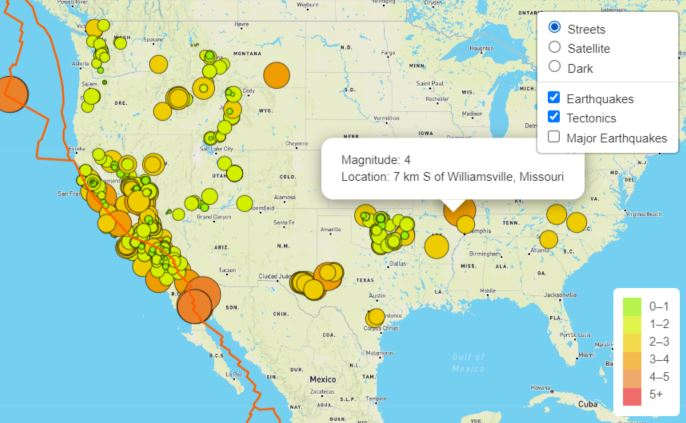

## Overview of the project

As the new Data visualization Specialist for The Disaster Reporting Network, I am tasked with building inaightful visualizations with interactive features highlighting earthquakes from around the world. My team lead beleives that having easy to use and informative maps on both web and mobile phones will generate positive buzz about The Disaster Reporting Network. In my role, I support web and mobile application development by using the latest GeoJSON data from the US geological website. 

### The tools needed for this project:

    Javascript
    - D3
    - Leaflet
    - Mapbox

My approach was to use the JavaScript and the D3.js library to retrieve the coordinates and magnitudes of the earthquakes from the GeoJSON data. Then I used the Leaflet library to plot the data on a Mapbox map through an API request and create interactivity for the earthquake data.

### Key Features of the map view:
---

- Users can change the style to what suits their preference bewtween Street, Satellite and Dark styles.

- 3 different layers, between Earthquakes, Tectonics and Major Earthquakes, allow the user to look at information to fit their needs. 

- The size and color of each earthquake marker is representative of the magnitude of the earthquake. Users can click on any earthquake marker to learn more about the magnitude and location of the earthquake.

